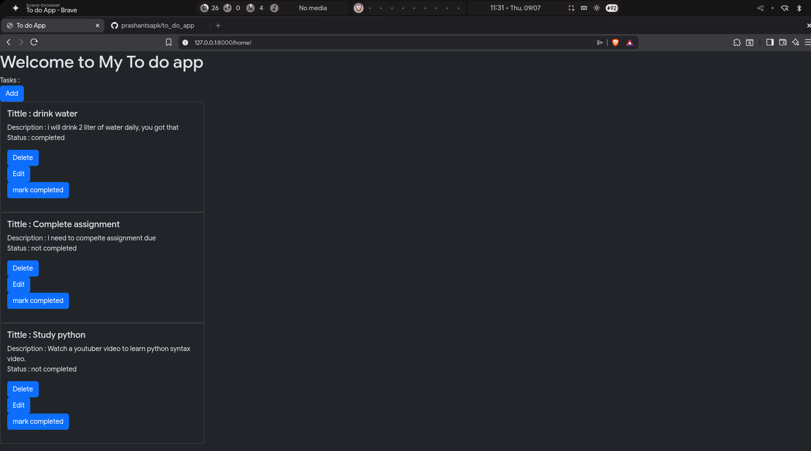

# ✅ My To Do App

A simple and clean To Do application built to manage daily tasks efficiently.

## 📸 Screenshot



## 🚀 Features

- Add new tasks
- View task details
- Edit existing tasks
- Delete tasks
- Mark tasks as completed
- Track task status (completed / not completed)

## 🛠️ Technologies Used

- Python
- Django
- HTML
- CSS
- SQLite

## ⚙️ Installation

Clone the repository:

```bash
git clone https://github.com/yourusername/to_do_app.git